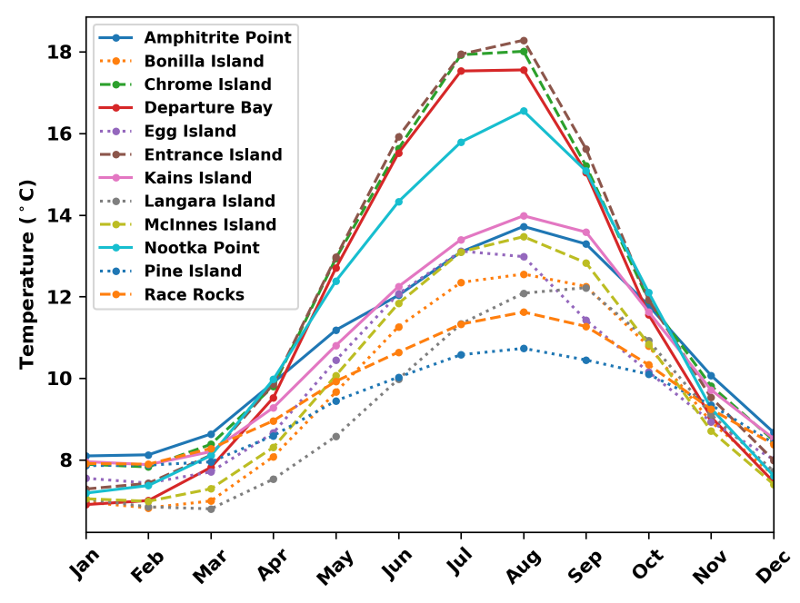
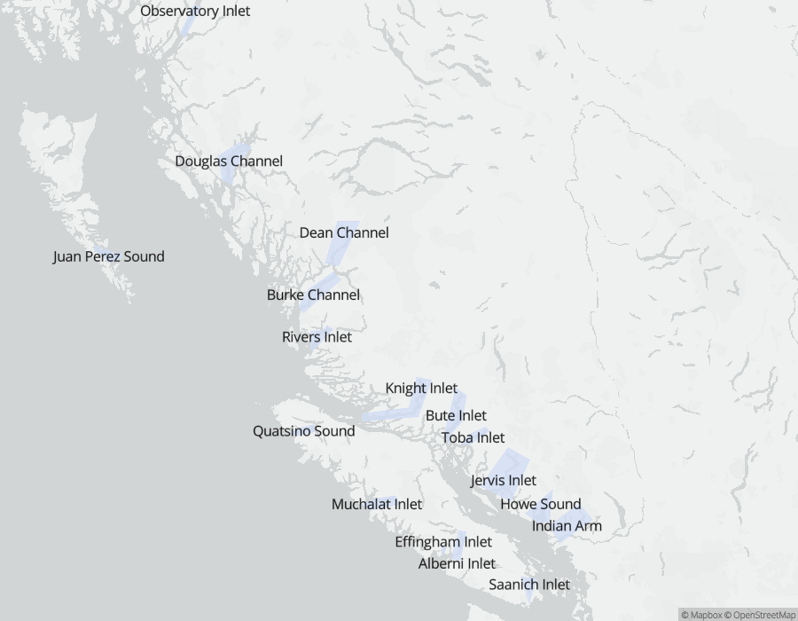
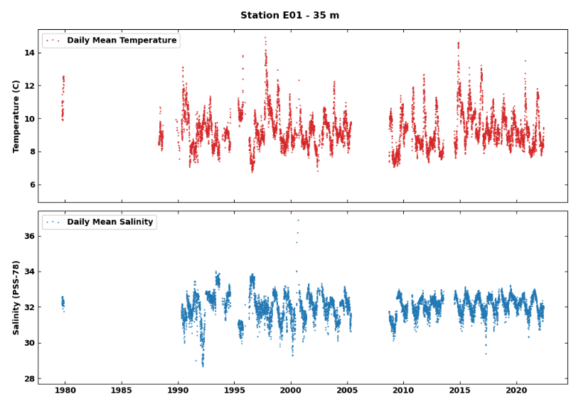
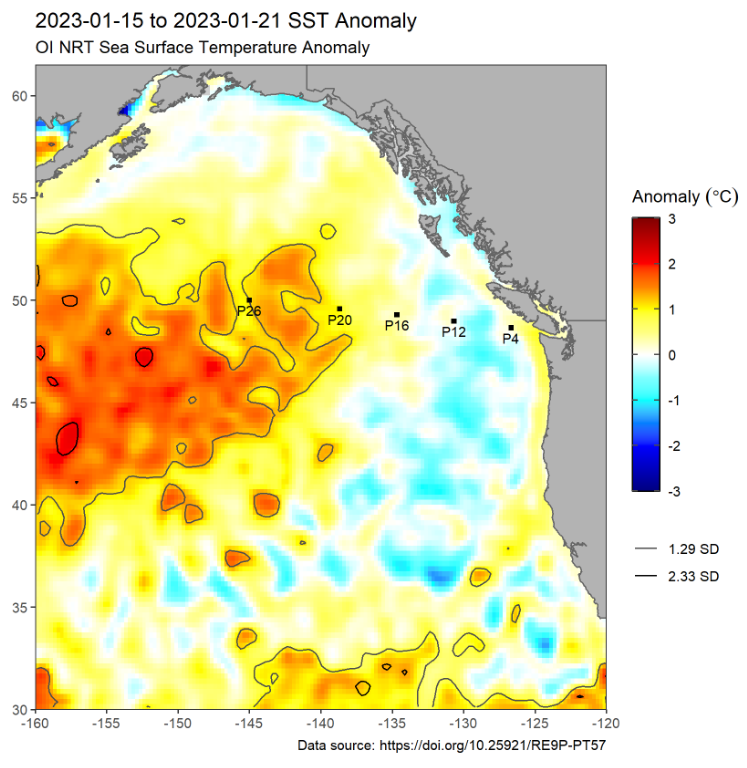
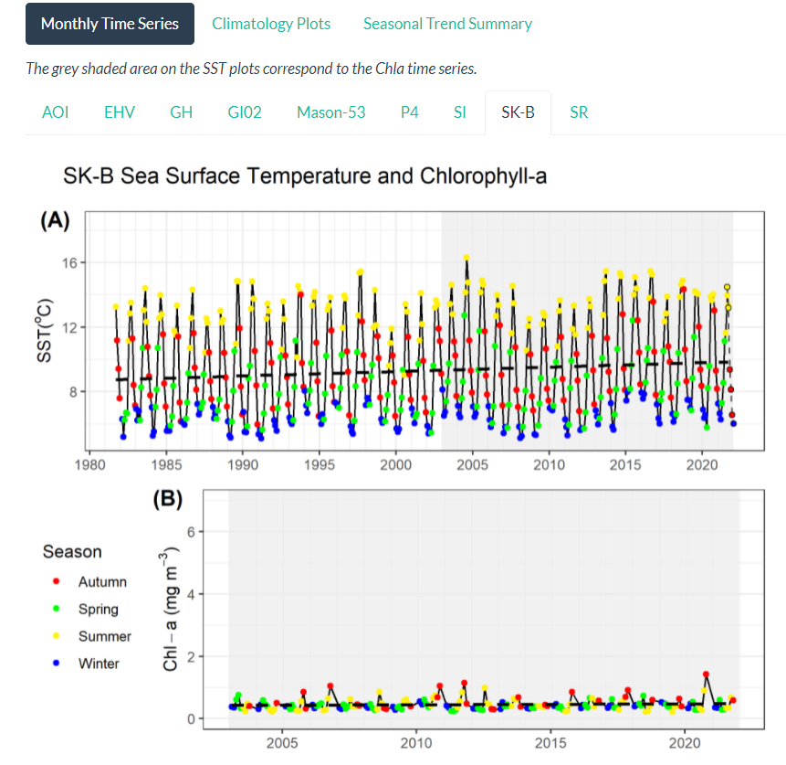

This page is under development. More information will be listed soon!

# Current Data Pages

## `New!📣` [`B.C. Lightstation Sea-Surface Temperature`](https://ios-osd-dpg.github.io/bc_lightstation_sst/)

* Observational data, trends and climatologies of SST and salinity from B.C. Lightstations. Daily observations extend as far back as 1914.

## [`Deep Water Properties of B.C. Inlets`](https://ios-osd-dpg.github.io/bc-inlets/)

*  Deep water properties, physical descriptions, and monitoring data for major inlets of British Columbia. Summaries include monthly and annual statistics and time series, and temporal availability of samples back to the 1930's. 

## `New!📣` [`Institute of Ocean Sciences OSD Mooring Data`](https://ios-osd-dpg.github.io/mooring_data_page/) 

* Time series of temperature and salinity from the Ocean Sciences Division mooring stations on the west coast of British Columbia.

## [`Marine Heatwave Monitoring of the Northeast Pacific`](https://github.com/BIO-RSG/Pacific_SST_NRT_Monitoring) 

* Satellite SST maps, anomalies, and buoy time series of the Northeast Pacific for tracking marine heatwaves.

## [`Sea-Surface Temperature and Chlorophyll-a Concentration Time Series`](https://ios-osd-dpg.github.io/SST_Chla_Report.html)

* Satellite time series from Pacific Marine Protected Areas and regions of interest, spanning 1981-2022.

