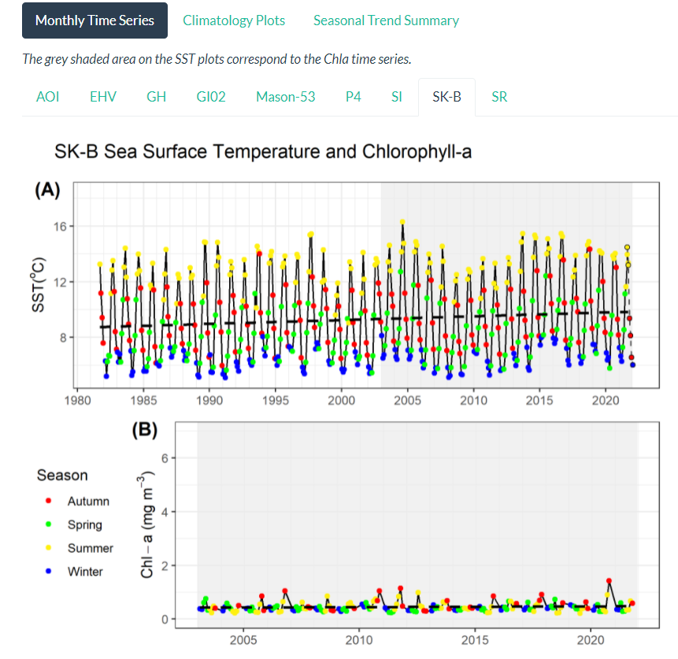

<!-- ## [Satellite Sea-Surface Temperature and Chlorophyll-a Concentration Time Series](https://ios-osd-dpg.github.io/SST_Chla_Report.html) -->

<!-- * Satellite time series of surface waters from Pacific Marine Protected Areas and regions of interest, spanning 1981-2022. -->

<!-- <a target="_blank" href="figures/screencap_sst_chla.png"> -->

<!--  -->

<!-- </a> -->
